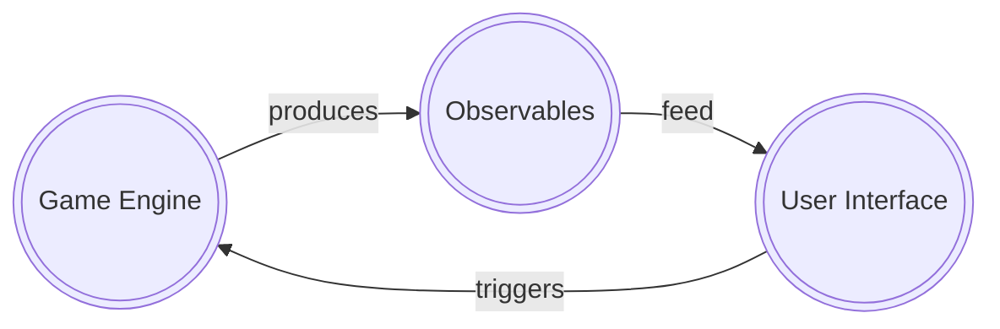
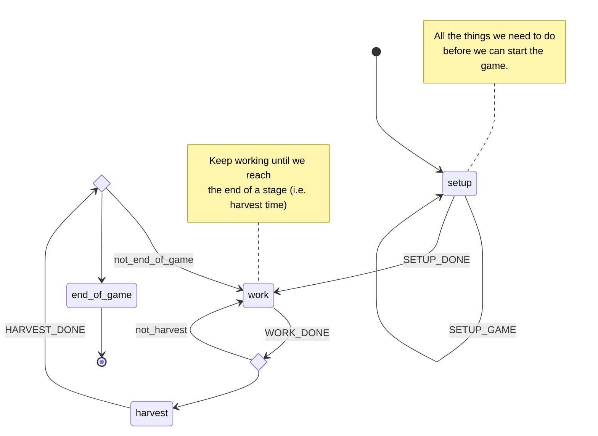
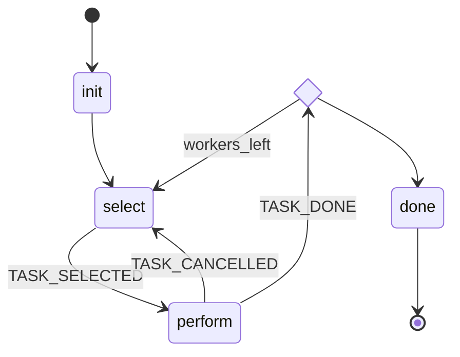

# Agricola

A deep dive exploration of reactive programming combining state machines ([XState][]) and observables ([RxJS][]) with a web-component-based ([Lit][]) single page application. In the end I hope to build the solo version of the popular board game.

## Architecture

### Boundaries

The game engine is managed by a single state machine split into multiple services.

We can produce a diverse range of observables from the state machine. The user interface components subscribe to these observables.

Even though the user interface is not allowed to subscribe directly to the state machine, it can however trigger events that will ultimately lead to state changes and new data being emitted by the observables.

In all circumstances data flows in **one and only one** direction.

### States Machines

#### Overview

The main state machine is kept relatively simple (YMMV) as each state is expected to spawn one or more services.

#### Work Service

The **Work Service** is given the number of workers for the active turn and remains active until all the workers are placed on the board.

[XState]: https://xstate.js.org/
[RxJS]: https://rxjs.dev/
[Lit]: https://lit.dev/